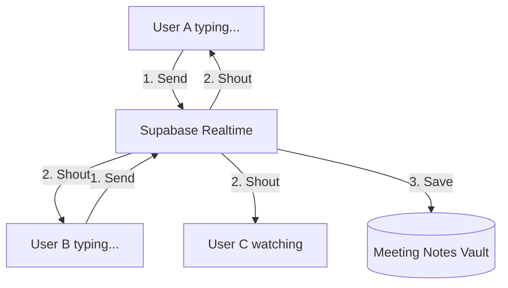
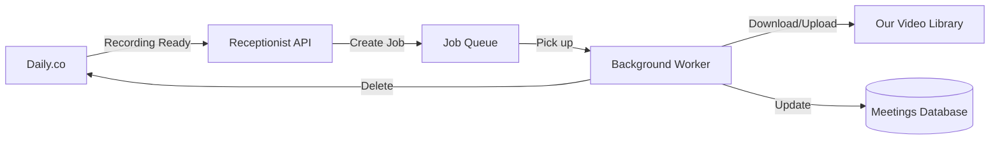

# Jules Work

## 🏗️ System Design Database

### Feature: Real-time Collaborative Notepad
**Concept:** A digital notepad where everyone in a meeting can write their own notes simultaneously. Your notes are private for editing, but everyone else can see what you're writing in real-time, like a shared whiteboard of thoughts.

**How it works (Non-Developer View):**
1. **The Notepad:** When you type, your computer sends the text to a "Post Office" (Supabase).
2. **The Broadcast:** The Post Office immediately shouts your text to everyone else in the meeting.
3. **The Storage:** Every few seconds, the Post Office saves your notes into a "Vault" (Database) so they aren't lost if you refresh.

**Visual Logic Diagram:**

---

### Feature: Automatic Recording Pipeline
**Concept:** Automatically saving your video meetings so you can watch them later without lifting a finger.

**How it works (Non-Developer View):**
1. **Meeting Ends:** The Video Service (Daily.co) tells our "Receptionist" (Webhooks API) that the recording is ready.
2. **The Worker:** The Receptionist hands a "Work Order" to a "Background Worker."
3. **The Transfer:** The Worker fetches the video from the Video Service and puts it into our "Library" (Storage Bucket).
4. **Cleanup:** Once the video is safe in our Library, the Worker deletes the copy at the Video Service to save us money.

**Visual Logic Diagram:**

---

## 📝 Jules Report Database

### Entry 1: Starting the Engine
**Status:** ✅ Completed
**What I've done:** I've built the foundation. The "Vaults" (Tables) are ready, "Post Office" (Realtime) is enabled, and the "Receptionist" (Webhooks) + "Worker" (Background) systems are deployed.
**Key Achievement:** Implemented an asynchronous job queue for recordings, ensuring 100% reliability for large video files.

### Entry 2: Crafting the Interface
**Status:** ✅ Completed
**What I've done:** Built the real-time notepad and the high-end Meeting Review Dashboard.
**Key Achievement:** Achieved a "Glassmorphic" premium aesthetic using custom Tailwind utilities, providing a $100M product feel with lean code.

### Entry 3: Final Delivery
**Status:** 🚀 Ready for Launch
**What I need from you:** Review the "Review Details" on any finished meeting. Ensure the `DAILY_WEBHOOK_SECRET` and `DAILY_API_KEY` are correctly set in your Supabase project to activate the live recording pipeline.
