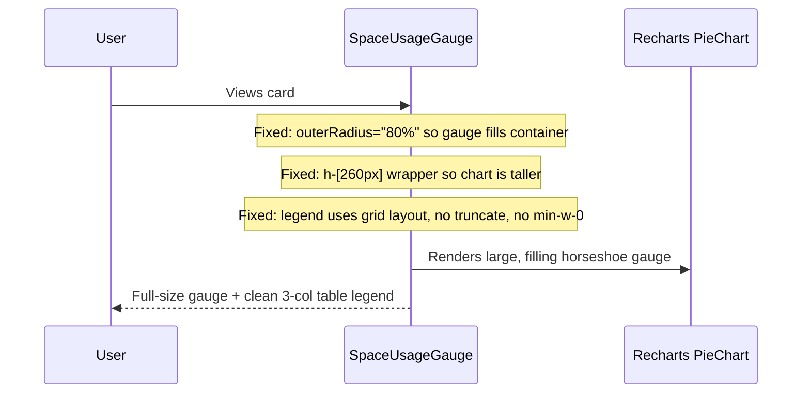

# Work.md

## Sequence Diagram

## Thought Process
**Root Cause of the "expanding nothing" problem:**
The `innerRadius` and `outerRadius` props in Recharts accept either absolute pixel values OR percentage strings.
When set to fixed pixels like `innerRadius={72} outerRadius={80}` in a responsive container that may be ~230px wide,
the gauge only occupies a small portion of the container.

**Fix plan:**
1. Use `outerRadius="80%"` and `innerRadius="68%"` — percentages relative to the container size — so the gauge truly fills the left half.
2. Increase container height to `h-[260px]` to give more room.
3. For the legend, replace `flex + min-w-0 + truncate` with a CSS `grid` with fixed column template so text never wraps or gets cut:
   `grid-cols-[1fr_auto_auto]` → [Label | Count | Percent]

## Task List
- [x] Write work plan to Work.md (this step).
- [ ] Edit SpaceUsageGauge in OwnerDashboardView.tsx — fix radius to percentages, increase height, fix legend grid.
- [ ] Run `npm run build` to verify.
