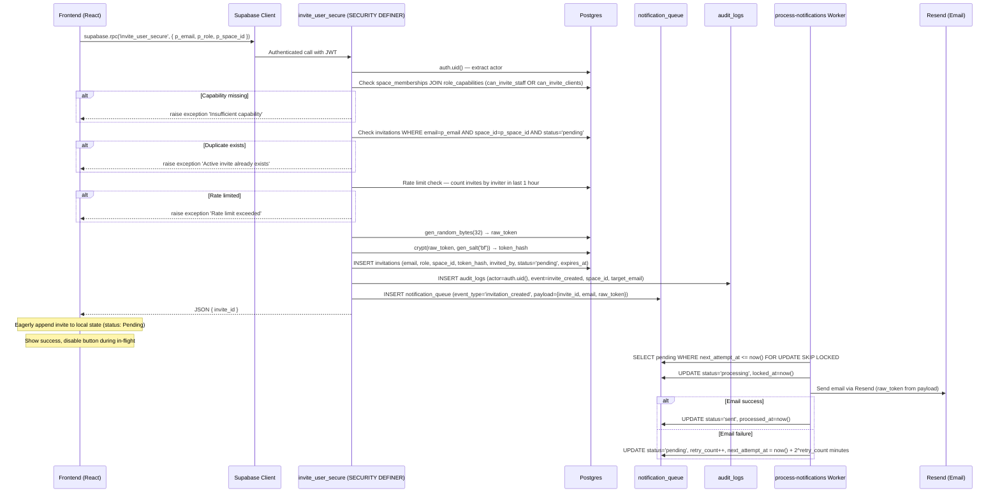
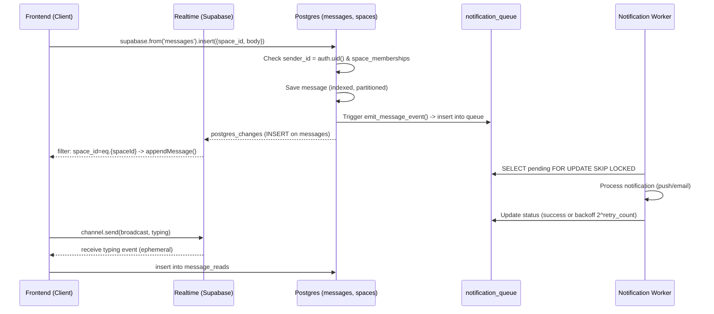

# Work.md

---

## ⚡ AGENT OWNERSHIP LEGEND
| Agent | Scope |
|-------|-------|
| **Agent 1 (THIS)** | Invitation Security Architecture — SaaS-Grade Hardening |

---

## AGENT 1 — Invitation Security Architecture Shift

### 🔷 Sequence Diagram — System & Logic Flow

---

## 🧠 AGENT 1 — Thought Process & Notes

### What I'm Building (Summary)
Enterprise-grade invitation security hardening. Five layers:
1. `invite_user_secure` — SECURITY DEFINER Postgres RPC (replaces Edge Function invitations-api send action)
2. Schema hardening: `invitations` table — add `token_hash`, `invited_by`, `status` columns; drop raw `token`
3. Schema hardening: `notification_queue` — add `locked_at`, `locked_by`, `last_error` columns
4. Add `can_invite_staff` and `can_invite_clients` capabilities to `capabilities` + `role_capabilities` tables
5. RLS hardening on `invitations` — no direct inserts, space-member-based reads only
6. Frontend refactor: Remove edge function call → use `supabase.rpc('invite_user_secure')`
7. Process-notifications worker upgrade: FOR UPDATE SKIP LOCKED, exponential backoff, locked_at tracking

### Key Schema Facts (Discovered)
- **invitations** table: has `token` (raw, plain), `organization_id`, `space_id`, `email`, `role`, `expires_at`, `accepted_at`. MISSING: `token_hash`, `invited_by`, `status`
- **notification_queue**: has `event_type`, `entity_type` (NOT NULL), `entity_id` (NOT NULL), `status`, `retry_count`, `next_attempt_at`. MISSING: `locked_at`, `locked_by`, `last_error`
- **capabilities**: has org+space scoped keys. MISSING: `can_invite_staff`, `can_invite_clients`
- **role_capabilities**: owners/admins have `manage_team`. MISSING explicit `can_invite_staff`/`can_invite_clients`
- **space_memberships**: has `profile_id`, `role`, `is_active` — this is what the RPC will check
- **role_capabilities**: joins `role_key` (text) → `capability_key` (text). This is what we join on.
- The `notification_queue.entity_id` is NOT NULL — we'll use `invite_id` as `entity_id`
- `pgcrypto` needed for `crypt()` and `gen_salt()` — must verify extension exists or enable it

### Migration Strategy
- **Migration file**: `20260227000001_invite_security_hardening.sql`
  - Add columns to `invitations`: `token_hash text`, `invited_by uuid → profiles`, `status text CHECK ('pending','accepted','revoked','expired')` DEFAULT 'pending'
  - Add columns to `notification_queue`: `locked_at timestamptz`, `locked_by text`, `last_error text`
  - Add new capabilities: `can_invite_staff`, `can_invite_clients`
  - Assign to role_capabilities: owner→both, admin→both, staff→can_invite_clients only
  - Enable pgcrypto extension
  - Drop/replace RLS on invitations
  - Create `invite_user_secure` SECURITY DEFINER function

### Frontend Strategy
- Search App.tsx for invitation sending code → replace calls to `invitations-api` edge function with `supabase.rpc('invite_user_secure', {...})`
- Keep `invitations-api` for the `accept` action only (consume_invitation RPC path not touched)
- Add loading state + specific error handling in the UI

### Worker Strategy
- Update `process-notifications/index.ts` to:
  - Use `FOR UPDATE SKIP LOCKED` via raw SQL
  - Track `locked_at` + `locked_by`
  - Exponential backoff: `2^retry_count` minutes
  - Handle `invitation_created` event type specifically (read `raw_token` from payload, send email via Resend)

---

## 📋 AGENT 1 — Task List

### Phase 1: Database Migration
- [x] 1.1 Apply migration: Enable pgcrypto, alter invitations table (add token_hash, invited_by, status)
- [x] 1.2 Apply migration: Alter notification_queue (add locked_at, locked_by, last_error)
- [x] 1.3 Apply migration: Add can_invite_staff + can_invite_clients capabilities
- [x] 1.4 Apply migration: Assign capabilities to roles in role_capabilities
- [x] 1.5 Apply migration: Drop existing invitations RLS policies + create hardened ones
- [x] 1.6 Apply migration: Create invite_user_secure() SECURITY DEFINER RPC function

### Phase 2: Worker Upgrade
- [x] 2.1 Upgrade process-notifications worker: FOR UPDATE SKIP LOCKED, exponential backoff, locked tracking
- [x] 2.2 Add invitation_created event handler (read raw_token from payload, send Resend email)
- [x] 2.3 Deploy updated worker to Supabase (Local deployment executed)

### Phase 3: Frontend Refactor
- [x] 3.1 Find invitation sending code in App.tsx
- [x] 3.2 Replace edge function call with supabase.rpc('invite_user_secure')
- [x] 3.3 Add loading state, disable button in-flight, surface specific errors

### Phase 4: Verification
- [x] 4.1 Verify migration applied successfully (check columns, function, policies)
- [x] 4.2 Check security advisors

---

## USER SECTION NOTES
*(No user notes yet — will be added as user comments arrive)*

---

## Current Step
**→ Agent 1 Complete. Handoff to next agent or await user direction.**

---

## ⚡ AGENT 2 — Messaging System Scale Architecture

### 🔷 Sequence Diagram — System & Logic Flow

### 🧠 AGENT 2 — Thought Process & Notes

#### What I'm Building (Summary)
A highly scalable messaging architecture designed for 10k+ users and millions of messages:
1. **Core Database:** `messages` table with immutable writes, proper indexing (composite space+created_at), and preparation for range partitioning.
2. **Membership & RLS:** `space_memberships` index-backed RLS queries avoiding circular dependencies entirely, eliminating 401s.
3. **Direct Write Path:** Delete edge function, use Postgres natively with `auth.uid()` implicitly setting sender.
4. **Realtime System:** Explicit filtered channels (`space_id=eq.{spaceId}`) instead of global listeners. Ephemeral typing indicators.
5. **Cursor Pagination:** Switch from offset to timestamp-based cursor (`lt(created_at, cursor)`).
6. **Async Notifications:** Database trigger inserts to `notification_queue`, decoupled from inline save.
7. **Read Receipts:** Uncoupled `message_reads` table to avoid write amplification on `messages`.
8. **Scalable Spaces:** Add `last_message_at` on spaces to avoid scanning messages on index page.
9. **Abuse Control:** DB trigger / function for rate limiting (max 30 msgs/min).
10. **Editing / Deleting:** RLS checks for `auth.uid() = sender_id`, soft deleting via `deleted_at`.

#### Database & Migrations Checkpoints
- We need to create a dedicated migration file for Agent 2 covering the table creates (`messages`, `message_reads`), triggers, indexes, and RLS.
- We must make sure not to interfere with Agent 1's `notification_queue` enhancements, but simply insert events of type `'message_created'` into it.

### 📋 AGENT 2 — Task List

#### Phase 1: Database Setup & Messaging Schema
- [ ] 1.1 Add migration: Create `messages` table with all needed columns.
- [ ] 1.2 Add migration: Create critical indexes (`idx_messages_space_created`, `idx_messages_space_id`, `idx_messages_sender`, `idx_messages_reply_to`).
- [ ] 1.3 Add migration: Create `space_memberships` table/indexes if not exist (or verify and add index `idx_space_memberships_space_user`).
- [ ] 1.4 Add migration: Setup table partitioning architecture for `messages` (e.g. range by created_at).

#### Phase 2: Security & RLS (Zero-Circular)
- [ ] 2.1 Add migration: Enable RLS on `messages`.
- [ ] 2.2 Add migration: Add `select_messages_by_membership` policy.
- [ ] 2.3 Add migration: Add `insert_messages_by_membership` policy.
- [ ] 2.4 Add migration: Add `update_own_message` and `soft_delete_own_message` policies.

#### Phase 3: Notifications & Async Queues
- [ ] 3.1 Add migration: Create trigger function `emit_message_event()` and attach to `messages`.

#### Phase 4: Extended Features (DB Layer)
- [ ] 4.1 Add migration: Create `message_reads` table with index.
- [ ] 4.2 Add migration: Add `last_message_at` to `spaces` table + trigger to update it on insert.
- [ ] 4.3 Add migration: Implement rate limiting constraint/trigger implementation (max 30 msgs/minute).

#### Phase 5: Client / Frontend Path Refactor
- [ ] 5.1 Frontend: Refactor write path to do direct DB insert (remove Edge function call or old queries).
- [ ] 5.2 Frontend: Update realtime subscription to use explicit space filter (`space_id=eq.{spaceId}`).
- [ ] 5.3 Frontend: Refactor pagination to cursor-based (`lt('created_at', oldestLoadedTimestamp)`).
- [ ] 5.4 Frontend: Implement ephemeral typing indicators via Realtime broadcast.
- [ ] 5.5 Frontend: Implement read receipts insert logic on view.
