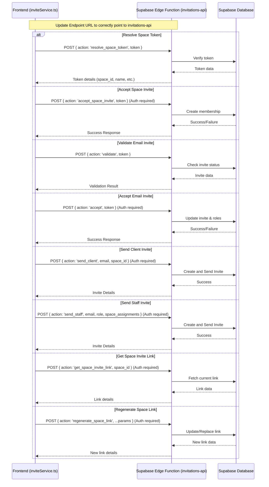
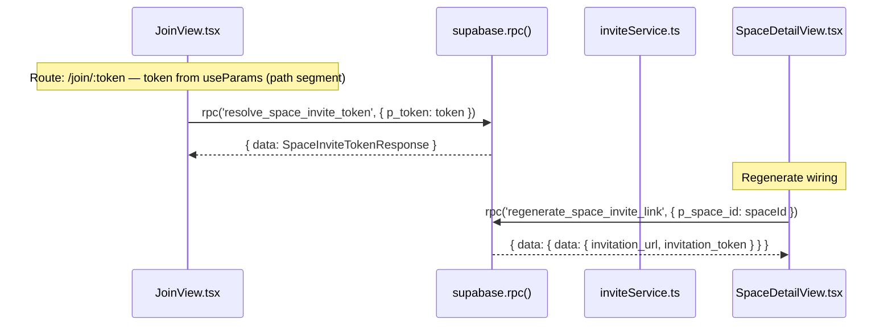
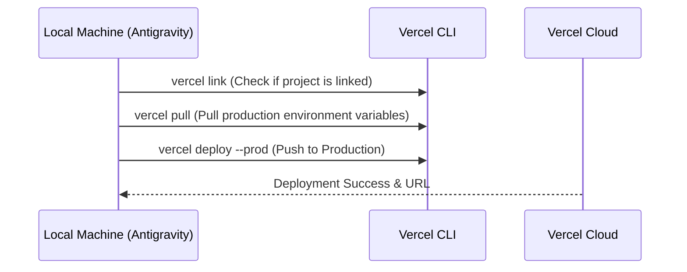
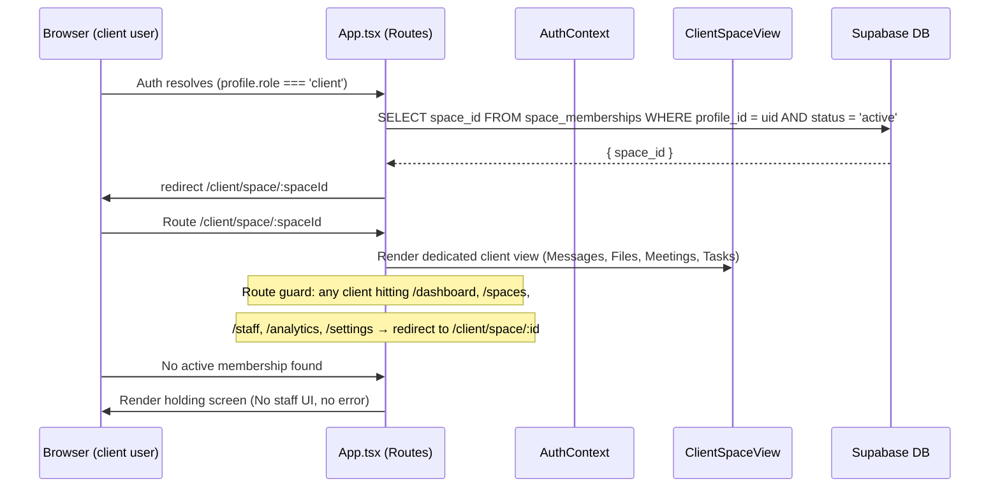
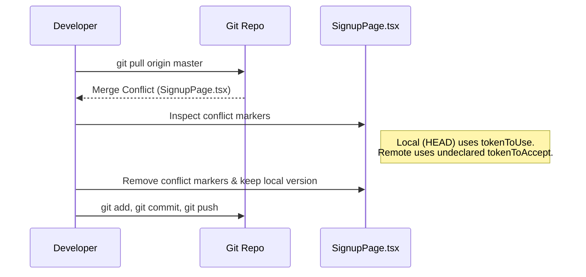

# Work.md

## Sequence Diagram

## Thought Process

### 1. Fix Endpoint URL Redundancy
I will start by fixing the redundancy in the invitation endpoint URL in `inviteService.ts`. The current implementation results in a double `/functions/v1/functions/v1` path.

**Task List:**
- [x] Locate all fetch calls in `src/services/inviteService.ts`.
- [x] Correct the URL template literals to use `${EDGE_FUNCTION_BASE_URL}/invitations-api`.

### 2. Verify and Update Request Payloads
I will ensure all invitation-related payloads contain the necessary information as requested. I'll check if any field is missing or named incorrectly based on the user's request for "invitation data and information".

**Task List:**
- [x] Review `resolveSpaceToken` payload.
- [x] Review `acceptSpaceInvite` payload.
- [x] Review `validateEmailInvite` payload.
- [x] Review `acceptEmailInvite` payload.
- [x] Review `sendClientInvite` payload.
- [x] Review `sendStaffInvite` payload.
- [x] Review `getSpaceInviteLink` payload.
- [x] Review `regenerateSpaceLink` payload.

### 3. Verification
I will verify the changes by checking if there are any other hardcoded URLs or incorrect payloads in related components.

**Task List:**
- [x] Search for `invitations-api` in the entire project.
- [x] Check `src/components/views/InviteStaffModal.tsx` for payload consistency.
- [x] Check `src/components/views/SpaceDetailView.tsx` for payload consistency.

## USER SECTION NOTES
- `inviteService.ts` needs to send `space_id` (not `spaceId`) in the request body for the regenerate action.
    - Status: Confirmed. The current implementation uses `space_id: spaceId` in the request body for `regenerate_space_link`, `send_client`, and `get_space_invite_link`.

### 5. Jules Fixes — Space Detail / Invite Section
Three precise fixes for the invitation flow, switching from Edge Function fetches to native Supabase RPC calls and fixing invite URL format.

**Fix A — Token extraction (already correct in App.tsx + JoinView, but inviteService.resolveSpaceToken must use RPC)**
- Route `/join/:token` ✅ (App.tsx line 533)
- `useParams<{ token: string }>()` ✅ (JoinView.tsx line 12)
- ❌ `inviteService.resolveSpaceToken()` still uses Edge Function fetch → switch to `supabase.rpc('resolve_space_invite_token', { p_token: token })`

**Fix B — RPC call for validation in inviteService.resolveSpaceToken**
- Replace `fetch(${EDGE_FUNCTION_BASE_URL}/invitations-api, ...)` with `supabase.rpc('resolve_space_invite_token', { p_token: token })`

**Fix C — Regenerate wiring in inviteService.regenerateSpaceLink**
- Replace Edge Function fetch with `supabase.rpc('regenerate_space_invite_link', { p_space_id: spaceId })`
- Parse response as `data.data.invitation_url` and `data.data.invitation_token`

**Fix D — Invite link URL format (secondary)**
- `apiService.ts` lines 295 & 331 use `/join?token=` (query param) → fix to `/join/${token}` (path segment)
- `InvitationsManagementView.tsx` line 184 same fix

**Task List:**
- [x] Fix `inviteService.resolveSpaceToken()` → use `supabase.rpc('resolve_space_invite_token', { p_token: token })`
- [x] Fix `inviteService.regenerateSpaceLink()` → use `supabase.rpc('regenerate_space_invite_link', { p_space_id: spaceId })` and parse `data.data.*`
- [x] Fix `apiService.ts` invite link URL format (lines 295, 331) from `?token=` to path segment
- [x] Fix `InvitationsManagementView.tsx` invite link URL format
- [x] Fix broken `SpaceInviteToken` import in `JoinView.tsx` (type doesn't exist — rename to `SpaceInviteTokenResponse`)
- [x] Fix `JoinView.tsx` property mismatches — all snake_case aligned to `SpaceInviteTokenResponse` + `redirect_path`

### 4. Deploy to Vercel
I will deploy the current application code to Vercel manually since the GitHub integration seems to have failed to trigger a build.

**Sequence Diagram:**

**Task List:**
- [ ] Check if Vercel CLI is installed.
- [ ] Verify project linkage to Vercel.
- [ ] Execute `vercel deploy --prod` to push current local changes to production.
- [ ] Provide the deployment URL to the user.

---

## Task 6 — Client Role-Based Routing & Guard

### Sequence Diagram

### Thought Process

`ClientPortalView.tsx` already EXISTS and is the correct view for clients. The problem is purely routing — clients land on the staff dashboard shell instead of being routed to their space.

**USER NOTE:** Do NOT create a new view. Wire the existing `ClientPortalView` to a proper route.

**Step 1 — Thin route wrapper: `ClientSpaceRoute.tsx`**
A wrapper component that reads `:spaceId` from URL params, fetches the space from `spaces` table (RLS ensures only their space), fetches their meetings, then renders the existing `ClientPortalView` with those props.

**Step 2 — Role-based redirect hook in `App.tsx`**
After auth resolves and `capabilityCache.role === 'client'`, query `space_memberships` for `profile_id = user.id AND status = 'active'`, then call `navigate('/client/space/:spaceId')`. If no membership row exists, render a holding screen in-place (no staff UI, no crash).

**Step 3 — Add `/client/space/:spaceId` route in `App.tsx`**
Add an explicit `<Route path="/client/space/:spaceId" element={<ClientSpaceRoute />} />` above the wildcard. Route is only reachable if the user is authenticated (enforced inside ClientSpaceRoute itself).

**Step 4 — Route guard in wildcard**
In the wildcard `<Route path="*">`, the existing `userRole === 'client'` branch currently renders `ClientPortalView` inline. Replace this entire branch with a redirect to `/client/space/:spaceId` (using the space ID from `space_memberships`).

**Task List:**
- [ ] Create `src/components/views/ClientSpaceRoute.tsx` — thin wrapper, fetches space + meetings, renders existing `ClientPortalView`
- [ ] Add `/client/space/:spaceId` route in `App.tsx` (above wildcard)
- [ ] Add client redirect effect in `App.tsx` (query `space_memberships`, `navigate()`)
- [ ] Replace old inline `ClientPortalView` branch in wildcard with redirect
- [ ] Handle no-membership edge case: holding screen (no staff UI, no error thrown)

---

## Task 7 — GitHub Merge Conflict Resolution

### Sequence Diagram

### Thought Process

**Issue:** A git pull resulted in a "Merge conflict in space.inc/src/views/SignupPage.tsx". I need to resolve the conflict so I can push my updates.

**Fix:**
- Inspect `SignupPage.tsx`. The conflict arises around session validation and redirection.
- Local (`HEAD`) correctly uses the declared `tokenToUse` instead of the outdated `tokenToAccept`. Furthermore, the required logic is already inserted before the `=======` marker.
- I will delete lines 59 to 71 containing the conflict markers and the redundant remote code.
- After fixing, I will `git add src/views/SignupPage.tsx`, commit the merge result, and `git push origin master`.

**Task List:**
- [x] Inspect both files involved (`LoginPage.tsx` merged cleanly manually).
- [x] Analyze `SignupPage.tsx` conflict.
- [x] Remove the conflict markers from `SignupPage.tsx`.
- [ ] Run `git add` and `git commit` to finalize the merge.
- [ ] Run `git push origin master` to sync with the remote repository.
