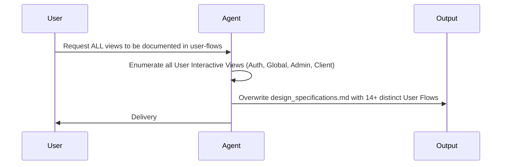

# Work Plan

## Logic Flow & System Flow

I will start build the documentation expansion of the sequence diagram.
- Task 1: Enumerate all major views (Auth, Dashboard, Invites, CRM, Inbox, Calendar, Drive, Tasks, Settings, etc).
- Task 2: Draft step-by-step User Flow descriptions for every screen (`"As a user, when I open this screen..."`).
- Task 3: Overwrite the existing `design_specifications.md` artifact to include this massive expansion.

## USER SECTION NOTES
*You noted that not all human interaction views were included in the previous document. I will expand the "User-flow description" section to include every single frontend view (Auth, Staff Views, Client Views, admin panels, etc.).*
