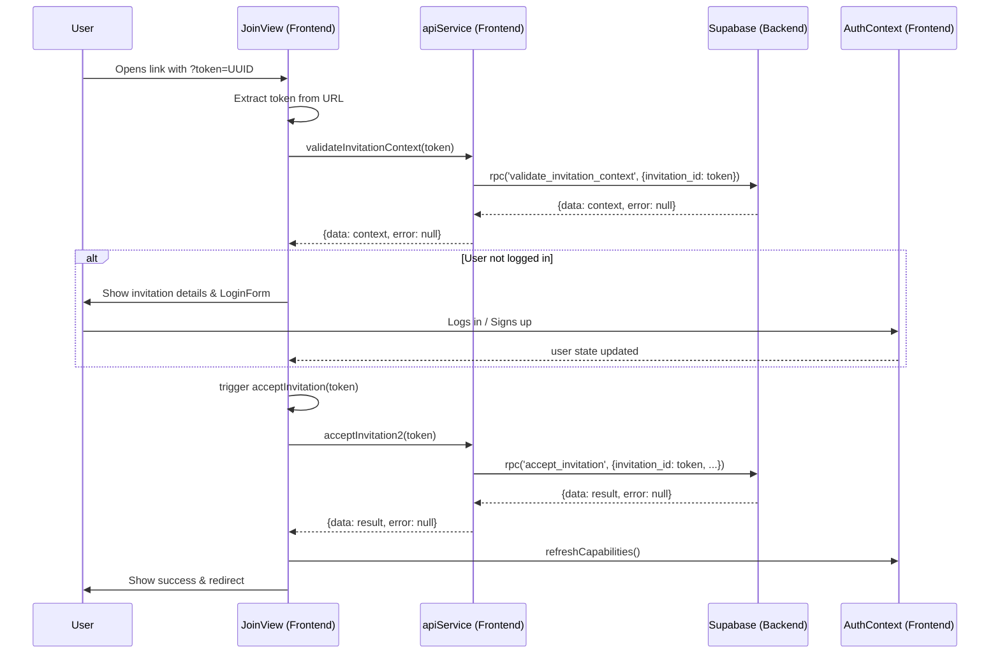
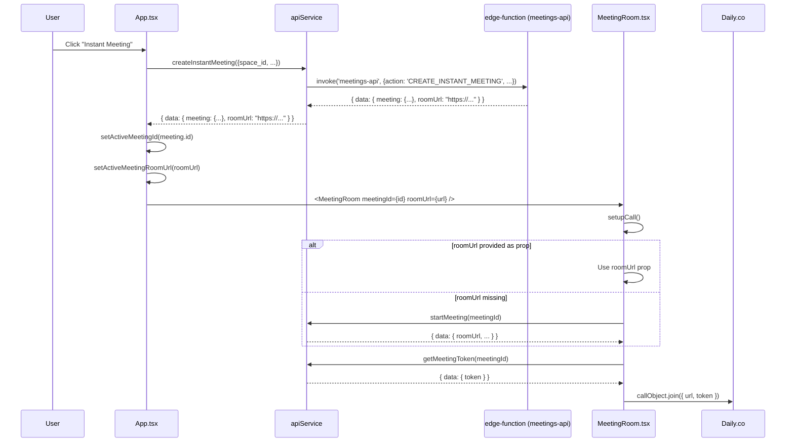

# Implementation Work Plan - Fixing JoinView.tsx Syntax and Logic Errors

## Sequence Diagram

## Thought Process

The current `JoinView.tsx` file is corrupted with non-code text at the bottom and uses incorrect method names from a previous version of the `apiService`. 

1.  **Cleanup**: I need to remove the trailing text after `export default JoinView;`.
2.  **API Integration**: I need to update the calls to `apiService` to match the "V3 (Supabase Native)" implementation currently in `apiService.ts`.
    - `validateInvitationToken` -> `validateInvitationContext`
    - `acceptInvitationToken` -> `acceptInvitation2`
3.  **Validation**: I'll ensure the flow correctly handles the "already logged in" vs "need to log in" states.

## Task List

- [x] Create `Work.md` with plan and diagram.
- [x] Remove corrupted lines (196-214) from `JoinView.tsx`.
- [x] Replace `apiService.validateInvitationToken` with `apiService.validateInvitationContext`.
- [x] Replace `apiService.acceptInvitationToken` with `apiService.acceptInvitation2`.
- [x] Verify imports and general structure.
- [x] Confirm syntax errors are resolved.

## Phase 2: Refactoring apiService.ts (File Upload & Management)

- [x] Edit 1: Verify `requestUploadVoucher` body uses camelCase.
- [x] Edit 2: In `confirmUpload`, change `file_id: fileId` to `fileId`.
- [x] Edit 3: In `deleteFile`, `restoreFile`, `hardDeleteFile`, `getSignedUrl`, `getSignedFileUrl`:
    - [x] Remove `organization_id` from body.
    - [x] Change `file_id: fileId` to `fileId`.
    - [x] Clean up method signatures if `organizationId` is unused. (Decided to keep signatures for compatibility with call sites, but removed from bodies)

## Phase 3: Meeting Orchestrator & Room URL Pass-through

### Sequence Diagram: Instant Meeting Flow

### Task List
- [x] **apiService.ts**:
    - [x] Update `requestUploadVoucher` return to unwrap `data.data`.
    - [x] Refactor `createInstantMeeting`: remove `organizationId`, unwrap return payload.
    - [x] Refine `startMeeting`: use `meetingId` (camelCase) in body and unwrap result.
- [x] **App.tsx**:
    - [x] Add `activeMeetingRoomUrl` state.
    - [x] Update `handleInstantMeeting` to capture room URL with optional chaining.
    - [x] Pass `roomUrl={activeMeetingRoomUrl}` and renamed `onClose` to `onLeave`.
- [x] **MeetingRoom.tsx**:
    - [x] Add `roomUrl` to `MeetingRoomProps` and renamed `onClose` to `onLeave`.
    - [x] In `setupCall`, updated fallback logic for `resolvedRoomUrl`.

## USER SECTION NOTES
- MeetingRoom redundant call fix: Pass `roomUrl` as prop and skip straight to `GET_TOKEN`.
- `apiService.startMeeting` signature needs `organizationId` kept (even if unused) to avoid breakage.
- `apiService.startMeeting` body uses `meetingId` (camelCase).
- `apiService.getMeetingToken` body uses `meetingId` (camelCase).
- `MeetingRoom` prop `onClose` should be `onLeave`.
