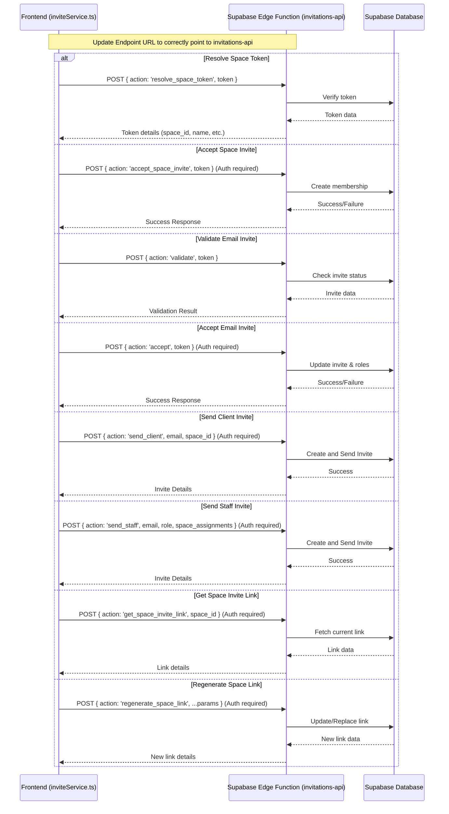
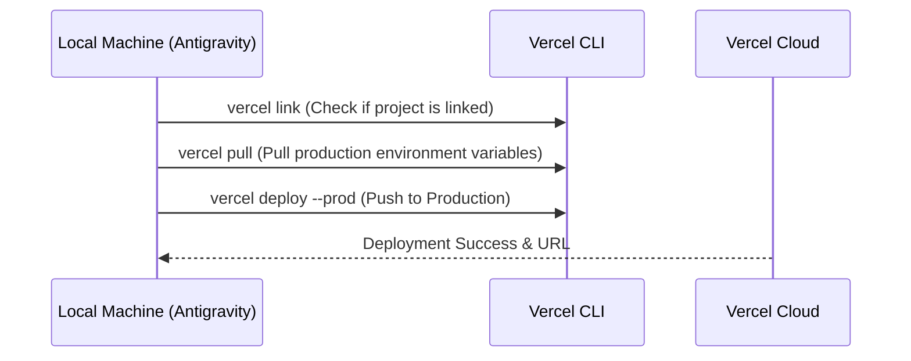

# Work.md

## Sequence Diagram

## Thought Process

### 1. Fix Endpoint URL Redundancy
I will start by fixing the redundancy in the invitation endpoint URL in `inviteService.ts`. The current implementation results in a double `/functions/v1/functions/v1` path.

**Task List:**
- [x] Locate all fetch calls in `src/services/inviteService.ts`.
- [x] Correct the URL template literals to use `${EDGE_FUNCTION_BASE_URL}/invitations-api`.

### 2. Verify and Update Request Payloads
I will ensure all invitation-related payloads contain the necessary information as requested. I'll check if any field is missing or named incorrectly based on the user's request for "invitation data and information".

**Task List:**
- [x] Review `resolveSpaceToken` payload.
- [x] Review `acceptSpaceInvite` payload.
- [x] Review `validateEmailInvite` payload.
- [x] Review `acceptEmailInvite` payload.
- [x] Review `sendClientInvite` payload.
- [x] Review `sendStaffInvite` payload.
- [x] Review `getSpaceInviteLink` payload.
- [x] Review `regenerateSpaceLink` payload.

### 3. Verification
I will verify the changes by checking if there are any other hardcoded URLs or incorrect payloads in related components.

**Task List:**
- [x] Search for `invitations-api` in the entire project.
- [x] Check `src/components/views/InviteStaffModal.tsx` for payload consistency.
- [x] Check `src/components/views/SpaceDetailView.tsx` for payload consistency.

## USER SECTION NOTES
- `inviteService.ts` needs to send `space_id` (not `spaceId`) in the request body for the regenerate action.
    - Status: Confirmed. The current implementation uses `space_id: spaceId` in the request body for `regenerate_space_link`, `send_client`, and `get_space_invite_link`.

### 4. Deploy to Vercel
I will deploy the current application code to Vercel manually since the GitHub integration seems to have failed to trigger a build.

**Sequence Diagram:**

**Task List:**
- [ ] Check if Vercel CLI is installed.
- [ ] Verify project linkage to Vercel.
- [ ] Execute `vercel deploy --prod` to push current local changes to production.
- [ ] Provide the deployment URL to the user.
