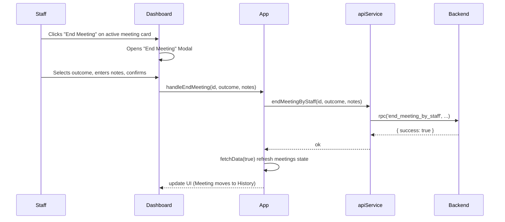

## Sprint 2: Meeting Overhaul & Manual End Meeting Feature

### Sequence Flow

### System Thought Process
1. I will add an `onEndMeeting` callback to `App.tsx` that will call `apiService.endMeetingByStaff` and refresh the data using `fetchData(true)`.
2. I will pass `onEndMeeting` to both `GlobalMeetingsView` and `SpaceDetailView`.
3. In `GlobalMeetingsView`, I will add a "End Meeting" button to the Upcoming meeting cards.
4. I will add a state `meetingToEnd` inside `GlobalMeetingsView` to trigger the End Meeting Review Modal.
5. In `SpaceDetailView`, I will do the same: add the button and the modal to allow staff to end meetings directly from the workspace view.
6. The modal will match the light-theme of the dashboard (using standard Headings, Text, Input/Textarea).

### Task List
- [x] Update Work.md with sequence diagram.
- [x] Add `handleEndMeeting` to `App.tsx`.
- [x] Update `GlobalMeetingsView.tsx` props, meeting cards, and add modal.
- [x] Update `SpaceDetailView.tsx` props, meeting cards, and add modal.

