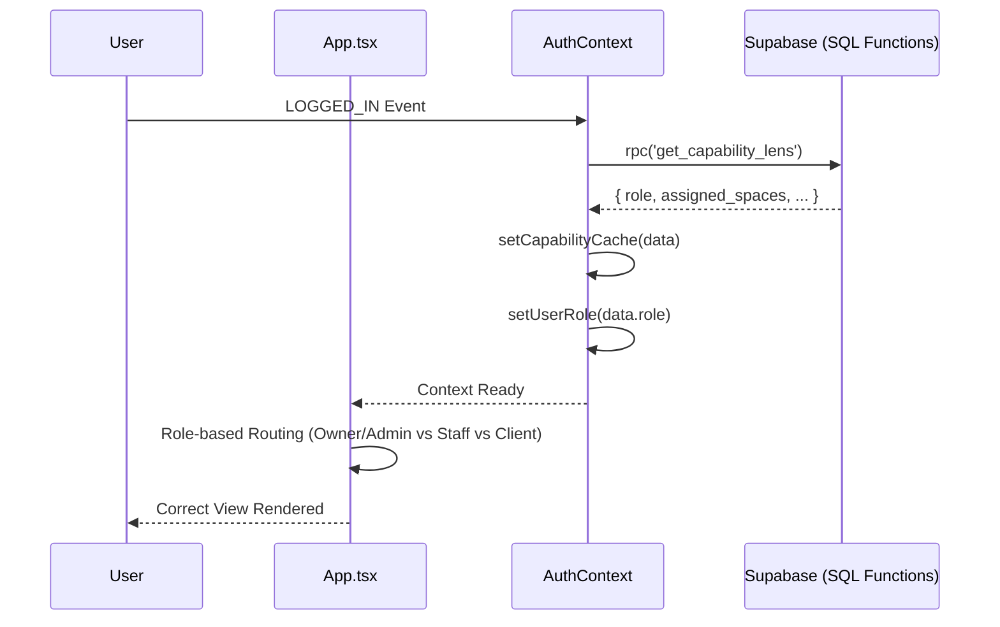
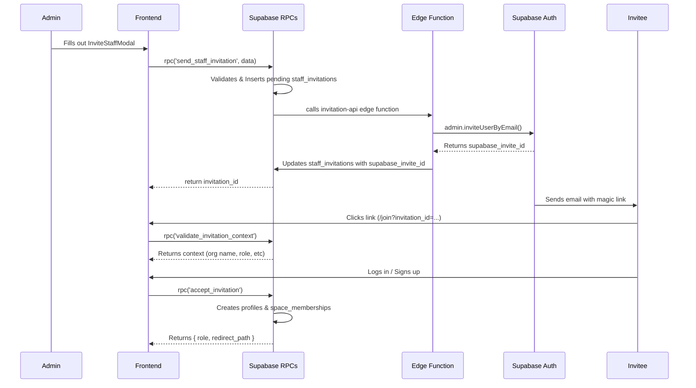

# Work.md

## Sequence Diagram (Auth & Routing Refactor)

## Thought Process

I am refactoring the core identity and access flow. 
- **Identity First**: The app must decide which "world" the user lives in (Owner/Admin Dashboard, Staff Dashboard, or Client Portal) based purely on their role. 
- **Caching**: `get_capability_lens` is a heavy operation. We fetch it once on sign-in and cache it.
- **Granular Checks**: The `can()` helper will now be space-aware by looking into the `capabilityCache`.

I will start by locking the SQL function shape to ensure the frontend code has a stable interface to build against.

### USER SECTION NOTES
- Report of missing credentials in payloads (e.g., `organization_id`).
- Need to audit all `apiService` calls in `App.tsx` to ensure `profile?.organization_id` is passed where required.
- Verify `get_capability_lens` returns `org_id` and it's stored in `AuthContext`.

### Task List: Auth & Routing Refactor

1. **Step 1: SQL Interface Stability**
    - [x] Apply migration to lock `get_capability_lens` return type.
    - [x] Verify the returned JSON matches the requested structure.

2. **Step 2: AuthContext Overhaul**
    - [x] Add `capabilityCache` and `userRole` state.
    - [x] Implement the `can()` logic for global and space-specific checks.
    - [x] Hook into `onAuthStateChange` for caching.

3. **Step 3: App.tsx Routing Fix**
    - [x] Replace capability-based routing with role-based switching.
    - [x] Ensure `OwnerDashboardView`, `StaffDashboardView`, and `ClientPortalView` are correctly mapped.

4. **Step 4: Verification**
    - [x] Test login flow for each persona.
    - [x] Verify `can()` works for both global and space-specific scenarios.

## Sequence Diagram (Invitation System)

## Thought Process: Invitation System Phase

I will build the invitation system following the Supabase native `inviteUserByEmail` flow. The core architecture relies on:
1. SQL RPCs (`send_staff_invitation`, `send_client_invitation`, `accept_invitation`, `validate_invitation_context`) to handle all validation, DB writes, and calling the edge function via `pg_net` or `http_post`.
2. An edge function (`invitation-api`) acting purely as a gateway to call `supabase.auth.admin.inviteUserByEmail` since RPCs cannot securely access the admin API.
3. Frontend updates (`JoinView`, `InviteStaffModal`, `AuthContext`, `App.tsx`) to surface the UI and intercept the login flow.

### Task List: Invitation System

1. **Database Layer (RPCs)**
   - [ ] Create `send_staff_invitation` RPC
   - [ ] Create `send_client_invitation` RPC
   - [ ] Create `accept_invitation` RPC
   - [ ] Create `validate_invitation_context` RPC

2. **Edge Function**
   - [ ] Create `invitation-api` Edge Function and deploy

3. **Frontend Layer**
   - [ ] Create `JoinView.tsx`
   - [ ] Create `InviteStaffModal.tsx`
   - [ ] Route `/join` in `App.tsx`
   - [ ] Update `AuthContext.tsx` handling of `onAuthStateChange` to intercept invitations
