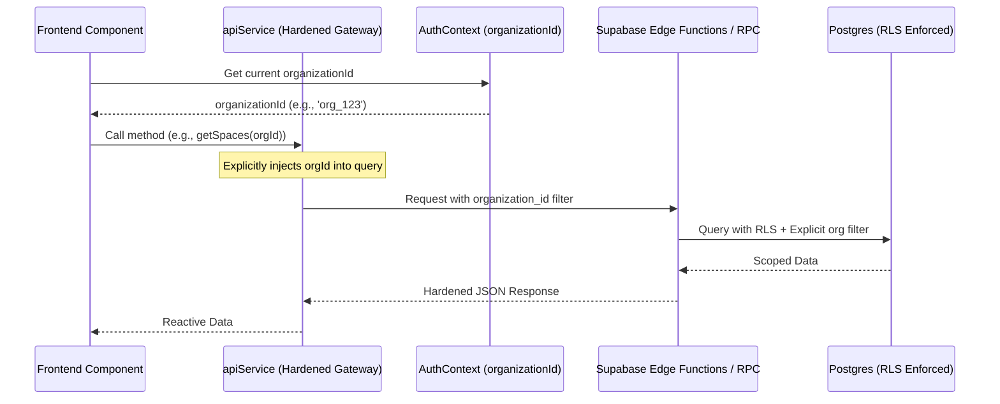
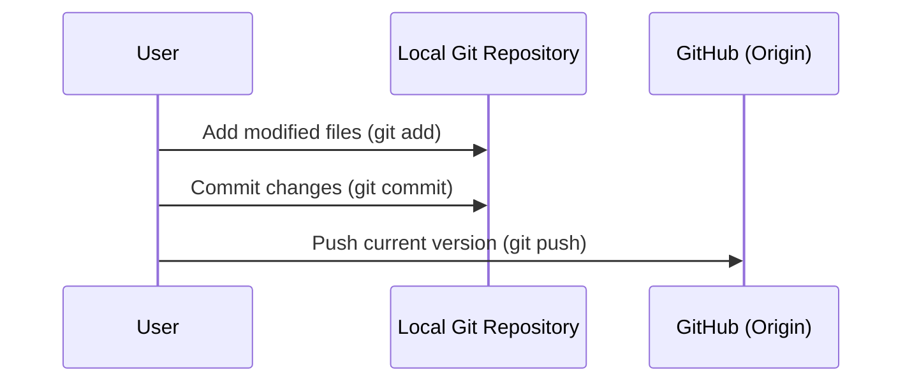

# Multi-Tenant Hardening Work Log

## Logic Flow: Hardened Gateway Pattern

## Thought Process

1. **Phase 1: Gateway Enforcement**
   - **Thought**: Direct `supabase.from` calls are a "leaky abstraction" in multi-tenant apps. Even with RLS, failing to filter in the query causes Postgres to scan more rows than necessary and relies solely on one security layer.
   - **Action**: Moved all dashboard and view logic to `apiService.ts`. Replaced `supabase.from('table').select('*')` with calls that require `organization_id`.

2. **Phase 2: Hook Hardening**
   - **Thought**: Realtime subscriptions were still subscribing to "all" changes or relying on implicit state.
   - **Action**: Refactored `useRealtimeFiles` to require `organization_id`. Added server-side filters to the subscription and client-side filters to the callback for "Defense-in-Depth".

3. **Phase 3: RPC & Edge Alignment**
   - **Thought**: Frontend calls must match backend expectations.
   - **Action**: Updated `messaging-api` and `meetings-api` (frontend calls) to ensure `organization_id` is always passed in payloads. Verified that Edge Functions call versioned SQL functions (`list_messages_v2`) that enforce tenancy.

4. **Phase 4: Global Data Propogation**
   - **Thought**: Data fetching in `App.tsx` was the primary entry point for stale/unhardened data.
   - **Action**: Re-wrote `fetchData` in `App.tsx` to use the hardened `apiService` methods, ensuring the first load is strictly scoped.

## Task List

- [x] Harden `apiService.ts` method signatures
- [x] Refactor `OwnerDashboardView.tsx` to use gateway
- [x] Refactor `StaffDashboardView.tsx` to use gateway
- [x] Refactor `SpaceDetailView.tsx` to use gateway
- [x] Refactor `SpacesView.tsx` to use gateway
- [x] Refactor `ClientPortalView.tsx` to use gateway
- [x] Update `App.tsx` global fetch logic
- [x] Harden `useRealtimeFiles.ts` hook
- [x] Harden `GlobalFilesView.tsx` call sites
- [x] Cleanup duplicate methods and lint errors in `apiService.ts`
- [x] Audit `InboxView.tsx`, `SettingsView.tsx`, and CRM views

## User Section Notes

- *User mentioned Claude's version of meetings works*: Verified the meeting token payload matches the expected `{ token, roomUrl, meetingId }` structure in `apiService.ts`.
- *Status 400 errors in file uploads*: Hardened the file upload workflow to ensures `organization_id` is passed to the `files-api` during voucher request and confirmation.

---
*Last Updated: 2026-03-30*

# GitHub Repo Update Work Log

## Logic Flow: Update Git Repository

## Thought Process

1. **Phase 1: Status Check**
   - **Thought**: Before pushing, I need to know what files have changed. I see `src/App.tsx` has modifications.
   - **Action**: Run `git status`.

2. **Phase 2: Stage and Commit**
   - **Thought**: I will stage all changed files and commit them with a descriptive message like "Update current version".
   - **Action**: Run `git add .` and `git commit -m "Update application with latest changes"`.

3. **Phase 3: Push**
   - **Thought**: Update the remote repository with the local commits.
   - **Action**: Run `git push origin master`.

## Task List

- [x] Check git status
- [ ] Update Work.md with thought process
- [ ] Stage all changes
- [ ] Commit changes
- [ ] Push to remote branch
