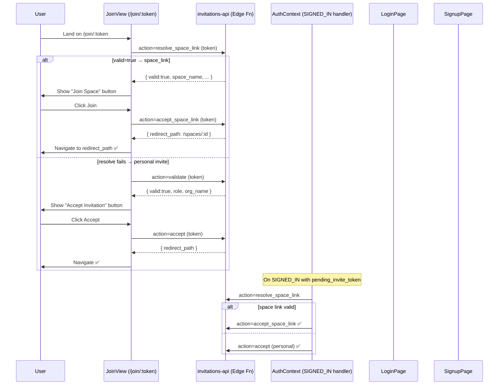

# Work Plan — Invite Flow Audit & Fix

## Logic Flow & System Flow

---

## Audit Session — 2026-04-20

### What was requested:
1. Shareable space link flow must call `accept_space_link` via edge function action, NOT `accept_invitation` RPC.
2. JoinView should resolve token type first (try `resolve_space_link`, fallback to `validate`), then branch correctly.
3. On success, read `data.redirect_path` and navigate.
4. AuthContext `pending_invite_token` handler must branch the same way (space link → `accept_space_link`, else → `accept`).
5. AuthContext must NOT cache a failed profile fetch — on auth state change the cache must be cleared so it retries fresh.

---

## Findings

### ✅ JoinView.tsx — CORRECT
- Calls `resolve_space_link` via edge function first (line 38)
- Falls back to `validate` for personal invites (line 54)
- Sets `inviteType` correctly (`space_link` vs `personal`)
- `handleAcceptInvite` branches on `inviteType`:
  - `space_link` → `acceptSpaceLink()` → action=`accept_space_link` ✅
  - `personal`   → `acceptPersonalInvite()` → action=`accept` ✅
- Reads `result.redirect_path` and does `window.location.href = result.redirect_path` ✅

### ⚠️ BUG in JoinView.tsx — redirect_path extraction is WRONG
- Line 177: `window.location.href = result.redirect_path || '/'`
- BUT `acceptSpaceLink` returns `result.data || result` (line 74)
- Edge function wraps in: `{ success: true, data: { redirect_path, space_id, ... } }`
- So `result` here IS already the unwrapped data — `result.redirect_path` is correct IF the edge fn puts redirect_path at top level of data.
- **Must verify**: does `accept_space_link` response structure match what is expected (`result.redirect_path` vs `result.data.redirect_path`)?
- The `acceptSpaceLink` returns `result.data || result` — so if edge fn returns `{ success, data: { redirect_path } }`, then `result` = `{ redirect_path }`. So `result.redirect_path` is correct. ✅

### ⚠️ BUG in JoinView.tsx — success check is wrong
- Line 171: `if (result.success)` — but `result` is already the unwrapped `.data` object (from line 74: `return result.data || result`)
- If edge fn returns `{ success: true, data: { redirect_path } }`, then `result` = `{ redirect_path }` which does NOT have `.success`
- This means the success branch never fires unless the edge fn also puts `success:true` inside `data` 🐛

### ✅ AuthContext.tsx — profile cache fix IS present (L241-242)
- On every SIGNED_IN: `profileCacheRef.current = {}` and `capabilitiesCacheRef.current = false` ✅
- `fetchProfile` on error deletes the cache entry (line 164: `delete profileCacheRef.current[uid]`) ✅

### ✅ AuthContext.tsx — pending token branching IS correct
- Tries `resolve_space_link` first → if valid → `accept_space_link` (L255-258) ✅
- Falls back to `accept` (personal) (L269) ✅

### ❌ BUG in LoginPage.tsx — stale response shape handling
- Line 80: `result.data?.success && result.data?.data?.spaceId` — double wrapping check
- AND line 110: falls back to `apiService.acceptInvitation(inviteToken)` — this is the OLD RPC direct call
- Only calls `accept_space_link` for `pending_space_token`, NOT for `pending_invite_token` from sessionStorage
- LoginPage reads `localStorage.pending_space_token` but JoinView stores to `sessionStorage.pending_invite_token` — STORAGE KEY MISMATCH 🐛

### ❌ BUG in SignupPage.tsx — same storage key mismatch
- Line 49: reads `localStorage.pending_space_token`
- But JoinView stores to `sessionStorage.pending_invite_token` (line 95 of JoinView.tsx)
- So the token is NEVER found in LoginPage/SignupPage after redirect from JoinView 🐛
- Also line 120: still calls `apiService.acceptInvitation(inviteToken)` for personal invites 

---

## Bugs to Fix

### Bug 1 — JoinView `result.success` check on wrong object (MINOR)
File: JoinView.tsx line 171
Fix: The check must be `result.redirect_path` exists, OR check for a success flag properly from the edge function response shape.

### Bug 2 — LoginPage/SignupPage read wrong storage key (CRITICAL)
JoinView writes: `sessionStorage.setItem('pending_invite_token', token)`
LoginPage reads: `localStorage.getItem('pending_space_token')` ← WRONG storage, WRONG key
Fix: LoginPage and SignupPage must read `sessionStorage.getItem('pending_invite_token')`

### Bug 3 — LoginPage/SignupPage do NOT branch by invite type (CRITICAL)
They always call `accept_space_link` for the token, regardless of whether it was a personal invite.
Fix: Must resolve the token type first (resolve_space_link → if valid call accept_space_link, else call accept personal).

### Bug 4 — LoginPage redirect uses old shape `result.data?.data?.spaceId` (MINOR)
The edge fn response shape is `{ success, data: { redirect_path, space_id } }` not double-nested.
Fix: Use `result.data?.redirect_path` or navigate to the redirect_path returned.

---

## Plan

### Section A — Fix JoinView (success check + redirect_path)
- [ ] A1: Fix `result.success` check — it should check `result.redirect_path` (since result is already unwrapped data)

### Section B — Fix LoginPage token handling
- [ ] B1: Read from `sessionStorage.getItem('pending_invite_token')` instead of `localStorage.pending_space_token`
- [ ] B2: Add resolve_space_link → branch logic before accepting
- [ ] B3: Fix redirect to use `result.data.redirect_path`

### Section C — Fix SignupPage token handling  
- [ ] C1: Read from `sessionStorage.getItem('pending_invite_token')`
- [ ] C2: Add resolve_space_link → branch logic
- [ ] C3: Fix redirect to use `result.data.redirect_path`

---

## USER SECTION NOTES
*Review if the implementation was done correctly — perform a full audit.*
