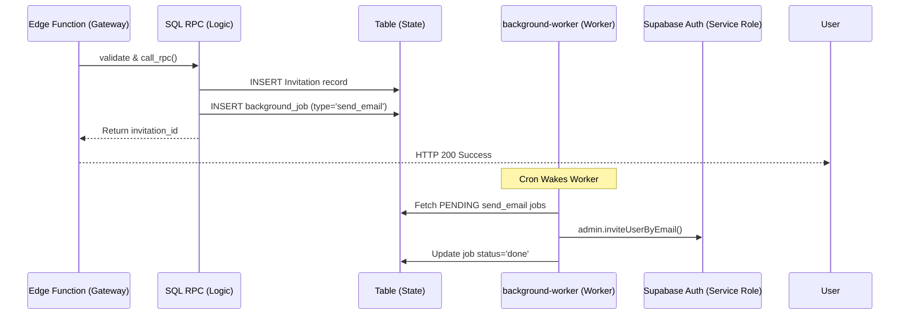
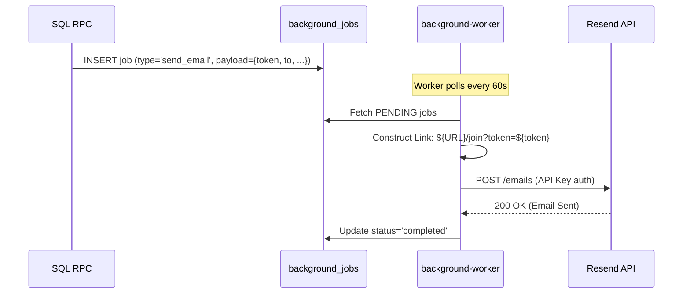

# Implementation Work Plan - Invitation System & Email Dispatch Fix

## Architecture Flow (Hardened SaaS)

## Phase 1: Database Logic (Status: COMPLETED)
- [x] **Fix SQL Search Path**: Updated `send_staff_invitation` and others to include `extensions`. (**FIXED 500 errors**)

## Phase 2: The Background Engine (Asynchronous Automation)
- [ ] **Build `background-worker`**: Generic handler for `public.background_jobs`. 
- [ ] **Worker Handshake**: Ensure worker uses `SERVICE_ROLE_KEY` to perform Admin Auth invites.
- [ ] **High-Frequency Cron**: Program `pg_cron` to process jobs every 1 minute.

## Phase 3: Thin Gateway & Cleanup
- [ ] **Thin Gateway Pass**: Remove redundant email logic from `invitations-api`.
- [ ] **Frontend Sync**: Update `apiService.ts` to correctly handle the new invitation responses.

---
## Founder's Research: Scalable Email Providers (Free Tier)

| Provider | Free Tier | Scaling Story | Why for Space.inc? |
| :--- | :--- | :--- | :--- |
| **Resend** | **3,000 emails/mo** | Linear pricing, modern API. | **Winner.** Native-like integration for Supabase. |
| **Postmark** | 100 emails/mo | Highest deliverability. | Too small for scaling. |
| **Amazon SES** | $0.10 / 1k | Cheapest bulk price. | High overhead for setup. Use later. |

---
## USER SECTION NOTES
- User reported not receiving emails.
- Confirmed jobs are stuck in `pending` status in `public.background_jobs`.
- **Strategy**: Maintain architectural purity (Edge -> SQL -> Worker).

---
## Resend Integration Flow

## Task List: Resend Implementation
- [ ] **Vault Setup**: Store `RESEND_API_KEY` in Supabase Secrets.
- [ ] **Worker Logic**: Update `background-worker/index.ts` to replace `inviteUserByEmail` with Resend Fetch.
- [ ] **Email Templates**: Define HTML/Text templates for Staff vs Client invitations.
- [ ] **Link Integrity**: Ensure `FRONTEND_URL` is set correctly in Edge Function env.

## Task List: Resolving DNS Check Failure
- [ ] **Identify Infrastructure**: Confirm which DNS provider is being used (Cloudflare, GoDaddy, etc.).
- [ ] **Syntax Audit**: Verify record types (CNAME vs TXT) and Host/Value mapping.
- [ ] **TTL & Propagation**: Check propagation via `dig` or `nslookup`.
- [ ] **The "Root vs Subdomain" Check**: Ensure records aren't being double-appended with the root domain.

---
## USER SECTION NOTES
- User reported: "DNS check failed: All required records are missing. Fix records in your DNS provider. Once fixed, restart verification."
- Analysis: Resend expects at minimum 2-3 DKIM records (usually CNAME) to prove you own the domain AND have permission to send from it.
