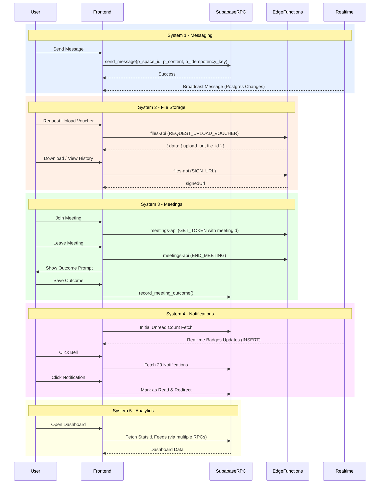

# Work.md - Space.inc Frontend Development

## Sequence Diagram

## Thought Process

I will tackle this task step-by-step according to the strict deployment order:
Messaging → Files → Meetings → Notifications → Analytics.

### Task List
#### System 1 — Messaging (SPA-30)
- [x] Task 1B: Create global error translation helper `friendlyError`.
- [x] Task 1A: Fix duplicate messages (use `.rpc('send_message')`).
- [x] Task 1C: Implement Message edit UI (`.rpc('edit_message')`).
- [x] Task 1D: Implement Message delete UI (`.rpc('delete_message')`).

#### System 2 — File Storage (SPA-28)
- [ ] Task 2A: Fix the upload bug `upload_url`.
- [ ] Task 2B: Secure file downloads via `SIGN_URL`.
- [ ] Task 2C: Version history Modal/Dropdown.

#### System 3 — Meetings (SPA-29)
- [ ] Task 3A: Fix `getMeetingToken` (`meeting_id` -> `meetingId`).
- [ ] Task 3B: Add meeting category selector.
- [ ] Task 3C: Implement lifecycle hooks `START_MEETING` and `END_MEETING`.
- [ ] Task 3D: Post-meeting outcome prompt.
- [ ] Task 3E: "View Recording" button.

#### System 4 — Notifications (SPA-32)
- [ ] Task 4A: Create `NotificationBell.tsx`.
- [ ] Task 4B: Implement notification dropdown.

#### System 5 — Analytics Dashboards (SPA-31)
- [ ] Task 5A: Owner dashboard.
- [ ] Task 5B: Staff dashboard.
- [ ] Task 5C: Space detail mini-stats bar.

---
## USER SECTION NOTES
- spaces.status is lowercase only ('active', 'archived').
- friendlyError() everywhere to never show raw API errors.
- Token and time efficiency is priority.
