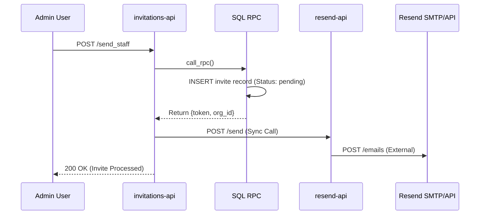

# Implementation Work Plan - Invitation System & Email Dispatch Fix

## Architecture Flow (Hardened SaaS - Direct Dispatch)

## Phase 1: Database Logic (Status: COMPLETED)
- [x] **Fix SQL Search Path**: Updated `send_staff_invitation` and others to include `extensions`. (**FIXED 500 errors**)

## Phase 2: The Background Engine (Asynchronous Automation)
- [x] **Audit RPCs**: Confirmed `send_staff_invitation` and `send_client_invitation` return `token` and `org_id`.
- [x] **Worker Update**: Updated `background-worker` to include Resend logic (as fallback/audit).

## Phase 3: Direct Dispatch (Resend-API Sync) - COMPLETED
- [x] **Create `resend-api`**: Dedicated edge function for template rendering.
- [x] **Update `invitations-api`**: Move from Async (Worker) to Sync (Direct) dispatch (V4).
- [x] **Template Audit**: Verified `email_templates` table and keys exist.
- [x] **Vercel Analytics**: Installed `@vercel/analytics` and added to `index.tsx`.
- [x] **Vercel Routing Fix**: Added `vercel.json` for SPA rewrites.
- [x] **Join Page**: Created `src/views/JoinPage.tsx` and integrated with `Routes`.
### Phase 3: Deployment & Invitation Flow (Manual Sharing) - IN PROGRESS
- [x] Vercel Analytics Integration
- [x] Vercel Routing Fix (vercel.json)
- [x] Join Page Implementation (/join)
- [x] SPA-20: Invite Link Generation Flow
  - [x] Update apiService with generate link RPCs
  - [x] Implement copy-button success state in Staff Modal
  - [x] Implement copy-button success state in Client Space creation
  - [x] Accessibility fixes (title attributes)
- [ ] **Deployment**: User to deploy functions via CLI.

---
## Founder's Research: Scalable Email Providers (Free Tier)

| Provider | Free Tier | Scaling Story | Why for Space.inc? |
| :--- | :--- | :--- | :--- |
| **Resend** | **3,000 emails/mo** | Linear pricing, modern API. | **Winner.** Native-like integration for Supabase. |
| **Postmark** | 100 emails/mo | Highest deliverability. | Too small for scaling. |
| **Amazon SES** | $0.10 / 1k | Cheapest bulk price. | High overhead for setup. Use later. |

---
## USER SECTION NOTES
- User reported not receiving emails.
- Diagnosis: `background-worker` was using Supabase Auth (AWS SES) instead of Resend, causing "Already Registered" errors for existing users.
- **New Strategy**: Direct sync call to `resend-api` for instant feedback and bypassing Auth service limitations.

---
## DNS Verification Protocol (Resend Logic)
- Status: **Pending Verification**
- Problem: "All required records are missing"
- Resolution: User adding TXT (DKIM/SPF) and MX records to DNS Provider.

---
## TASK LIST: High Performance Implementation
- [ ] Step 1: Create `supabase/functions/resend-api/index.ts`.
- [ ] Step 2: Update `supabase/functions/invitations-api/index.ts` to V4.
- [ ] Step 3: Verify `email_templates` database data.
- [ ] Step 4: Deploy functions.
