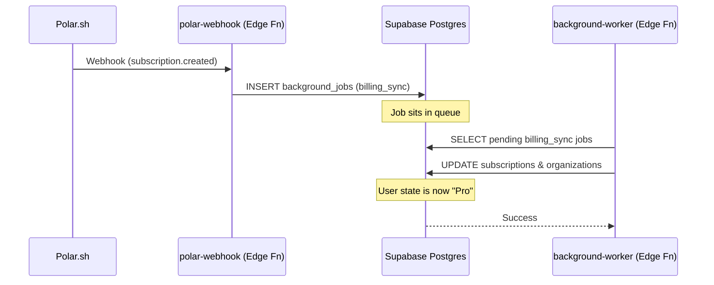

# Payment & Subscription Architecture (Polar.sh Integration)

## Overview
This document outlines the system architecture for integrating payments via Polar.sh, processing them asynchronously, and enforcing plan-based rate limits and quotas.

## System Components

### 1. Event Capture (Polar.sh Webhook)
- **Role**: Entry point for payment notifications.
- **Location**: `space.inc/supabase/functions/polar-webhook`
- **Process**:
  1. Receives `POST` requests from Polar.sh.
  2. Verifies the HMAC signature using `POLAR_WEBHOOK_SECRET`.
  3. Extracts the payload and event ID.
  4. Inserts a new job into the `public.background_jobs` table:
     - `job_type`: `billing_sync`
     - `status`: `pending`
     - `payload`: Full Polar webhook JSON.
     - `idempotency_key`: Polar Event ID (prevents double processing).

### 2. Event Processing (Background Worker)
- **Role**: Links the payment to a user/organization and updates the local state.
- **Location**: `space.inc/supabase/functions/background-worker`
- **Process**:
  1. Picks up `billing_sync` jobs.
  2. Extracts the customer email from the payload.
  3. Finds the `profile` and its `organization_id` associated with that email.
  4. Updates `public.subscriptions` with:
     - `polar_customer_id`
     - `polar_subscription_id`
     - `plan_tier` (e.g., 'starter', 'pro')
     - `status` (e.g., 'active')
  5. Updates `public.organizations.plan_tier` and `billing_status`.

### 3. Quota Enforcement (Database RPCs)
- **Role**: Blocks actions that exceed the limits of the current plan.
- **Mechanism**: RPC-level checks on `public.org_quotas`.
- **Flow**:
  1. A user attempts an action (e.g., `create_space`).
  2. The RPC calls `check_quota(org_id, 'max_spaces')`.
  3. If the quota is reached, it raises an exception (`QUOTA_EXCEEDED`).

## Data Flow Diagram

## Key Tables
- `public.background_jobs`: Transactional queue for webhook events.
- `public.subscriptions`: Records of Polar subscription metadata.
- `public.organizations`: High-level billing state (`plan_tier`).
- `public.org_quotas`: Hard limits enforced by the system.
